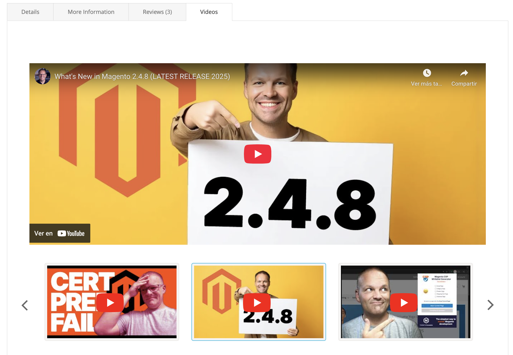
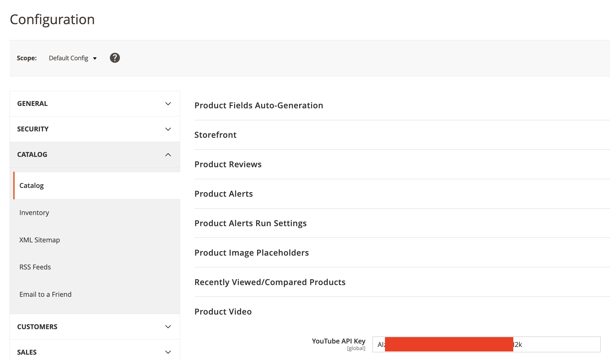
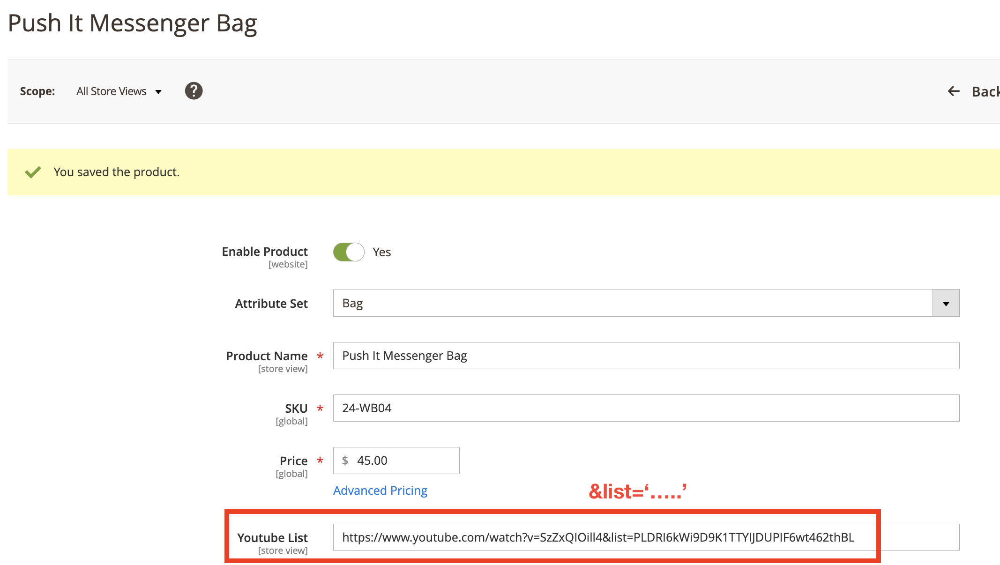

# YouTube List Module for Magento 2

[](https://magento.com/)
[](https://php.net/)
[](https://opensource.org/licenses/OSL-3.0)

A powerful Magento 2 module that allows you to add YouTube video lists to your products. Display embedded videos, playlists, and individual videos with a beautiful carousel interface.

## 📋 Table of Contents

- [Features](#-features)
- [Screenshots](#-screenshots)
- [Installation](#-installation)
- [Configuration](#-configuration)
- [Usage](#-usage)
- [GraphQL API](#graphql-api)
- [Testing](#-testing)
- [Code Quality](#-code-quality)
- [Architecture](#-architecture)
- [Contributing](#-contributing)

## ✨ Features

- **YouTube Video Integration**: Add YouTube videos to any product
- **Multiple Video Support**: Support for playlists, individual videos, and embedded videos
- **Beautiful UI**: Responsive carousel interface for multiple videos
- **GraphQL API**: Full GraphQL support for headless implementations
- **Admin Configuration**: Easy setup through Magento admin
- **YouTube API Integration**: Automatic thumbnail and video data fetching
- **Responsive Design**: Works perfectly on desktop and mobile devices

## 📸 Screenshots

### Product Page Display


### Admin Configuration


### Product Attribute Setup


## 🚀 Installation

### Method 1: Composer (Recommended)

```bash
composer require artaza/module-youtubelist
bin/magento module:enable Artaza_YoutubeList
bin/magento setup:upgrade
bin/magento cache:flush
```

### Method 2: Manual Installation

1. Download the module files
2. Place them in `app/code/Artaza/YoutubeList/`
3. Run the following commands:

```bash
bin/magento module:enable Artaza_YoutubeList
bin/magento setup:upgrade
bin/magento cache:flush
```

## ⚙️ Configuration

### 1. YouTube API Key Setup

1. Go to **Stores > Configuration > Catalog > Catalog > Product Video**
2. Enter your YouTube API Key
3. Save the configuration

### 2. Module Configuration

1. Go to **Stores > Configuration > Artaza > YouTube List**
2. Enable the module
3. Configure additional settings as needed

## 📝 Usage

### Adding YouTube Videos to Products

1. **Navigate to a Product**: Go to **Catalog > Products** and edit any product
2. **Add YouTube URL**: In the product form, find the "Youtube List" attribute
3. **Enter YouTube URL**: Add your YouTube URL in one of these formats:

#### Supported URL Formats:

- **Playlist**: `https://www.youtube.com/watch?v=SzZxQIOill4&list=PLDRI6kWi9D9K1TTYIJDUPIF6wt462thBL`
- **Single Video**: `https://www.youtube.com/watch?v=SzZxQIOill4`
- **Embed URL**: `https://www.youtube.com/embed/SzZxQIOill4`
- **Multiple Videos**: Separate multiple URLs with commas

#### Example:
```
https://www.youtube.com/watch?v=SzZxQIOill4&list=PLDRI6kWi9D9K1TTYIJDUPIF6wt462thBL
```

4. **Save the Product**: The videos will automatically appear on the product page

### Frontend Display

The module automatically displays:
- **First Video**: As the main embedded player
- **Additional Videos**: In a beautiful carousel below
- **Thumbnails**: Automatic YouTube thumbnails
- **Responsive Design**: Works on all devices

## 🔌 GraphQL API

The module provides full GraphQL support for headless implementations:

### Query Example

```graphql
{
  products(filter: { sku: { eq: "24-WB04" } }) {
    items {
      name
      sku
      youtube_videos {
        url
        image
      }
    }
  }
}
```

### Response Example

```json
{
  "data": {
    "products": {
      "items": [
        {
          "name": "Push It Messenger Bag",
          "sku": "24-WB04",
          "youtube_videos": [
            {
              "url": "https://www.youtube.com/embed/SzZxQIOill4",
              "image": "https://img.youtube.com/vi/SzZxQIOill4/mqdefault.jpg"
            },
            {
                  "url": "https://www.youtube.com/embed/nqTFVFWa-n0",
                  "image": "https://i.ytimg.com/vi/nqTFVFWa-n0/mqdefault.jpg"
            },
            {
                  "url": "https://www.youtube.com/embed/W9P-ykNCNjE",
                  "image": "https://i.ytimg.com/vi/W9P-ykNCNjE/mqdefault.jpg"
            }            
          ]
        }
      ]
    }
  }
}
```

## 🧪 Testing

The module includes comprehensive unit tests following Magento 2 standards.

### Running Tests

```bash
# Run all tests
vendor/bin/phpunit app/code/Artaza/YoutubeList/Test/Unit/

# Run specific test classes
vendor/bin/phpunit app/code/Artaza/YoutubeList/Test/Unit/Helper/DataTest.php
vendor/bin/phpunit app/code/Artaza/YoutubeList/Test/Unit/Model/Resolver/YoutubeVideosTest.php
```

### Test Coverage

- ✅ **Helper Tests**: Complete coverage of `Data` helper methods
- ✅ **Resolver Tests**: Full coverage of GraphQL resolver
- ✅ **ViewModel Tests**: Product page view model testing
- ✅ **Edge Cases**: Null values, invalid URLs, empty responses

## 🎯 Code Quality

The module follows Magento 2 coding standards and best practices:

### Code Standards

- ✅ **PSR-4 Autoloading**: Proper namespace structure
- ✅ **Magento 2 Standards**: Follows official coding guidelines
- ✅ **PHPCS Compliance**: Passes Magento 2 coding standards
- ✅ **Type Declarations**: Full PHP 8.1+ type support
- ✅ **Documentation**: Comprehensive PHPDoc blocks

### Quality Checks

```bash
# Run coding standards check
vendor/bin/phpcs --standard=Magento2 app/code/Artaza/YoutubeList/

# Auto-fix coding standards
vendor/bin/phpcbf --standard=Magento2 app/code/Artaza/YoutubeList/
```

## 🏗️ Architecture

### Module Structure

```
Artaza_YoutubeList/
├── composer.json                 # Composer configuration
├── registration.php              # Module registration
├── README.md                     # Module documentation
├── Helper/
│   └── Data.php                  # Core YouTube API integration
├── Model/
│   └── Resolver/
│       └── YoutubeVideos.php    # GraphQL resolver
├── ViewModel/
│   └── ProductPage.php          # Product page view model
├── Setup/
│   └── Patch/
│       └── Data/
│           └── AddYoutubelistProductAttribute.php  # Data patch for attribute
├── etc/
│   ├── module.xml               # Module definition
│   ├── config.xml               # Module configuration
│   ├── acl.xml                  # Access Control List
│   ├── catalog_attributes.xml   # Product attribute definition
│   ├── schema.graphqls          # GraphQL schema
│   └── adminhtml/
│       └── system.xml           # Admin configuration
├── view/
│   └── frontend/
│       ├── layout/
│       │   └── catalog_product_view.xml  # Product page layout
│       ├── templates/
│       │   └── productPage.phtml         # Frontend template
│       └── web/
│           ├── css/
│           │   └── listyoutube.css       # Frontend styles
│           ├── js/
│           │   └── youtube-list.js       # Frontend JavaScript
│           └── images/
│               ├── youtube-logo.png      # YouTube logo
│               ├── play.png              # Play button
│               └── arrow.svg             # Carousel arrows
├── i18n/
│   └── es_CL.csv                # Spanish translations
├── docs/
│   └── images/                  # Documentation images
└── Test/
    └── Unit/
        ├── phpunit.xml           # PHPUnit configuration
        ├── README.md             # Test documentation
        ├── Helper/
        │   └── DataTest.php      # Helper unit tests
        ├── Model/
        │   └── Resolver/
        │       └── YoutubeVideosTest.php  # Resolver unit tests
        └── ViewModel/
            └── ProductPageTest.php        # ViewModel unit tests
```

### Key Components

- **Helper (Data)**: Handles YouTube API calls and video processing
- **GraphQL Resolver**: Provides API access to video data
- **ViewModel**: Manages product page video display
- **Template**: Renders the video carousel interface

## 🤝 Contributing

We welcome contributions! Please follow these guidelines:

1. **Fork the repository**
2. **Create a feature branch**: `git checkout -b feature/amazing-feature`
3. **Follow coding standards**: Run PHPCS before submitting
4. **Add tests**: Include unit tests for new functionality
5. **Submit a pull request**

### Development Setup

```bash
# Install dependencies
composer install

# Run tests
vendor/bin/phpunit app/code/Artaza/YoutubeList/Test/Unit/

# Check coding standards
vendor/bin/phpcs --standard=Magento2 app/code/Artaza/YoutubeList/
```

## 📄 License

This module is licensed under the [OSL 3.0](https://opensource.org/licenses/OSL-3.0) license.

## 🆘 Support

For support, please:

1. Check the [documentation](#-usage)
2. Review [existing issues](https://github.com/your-repo/issues)
3. Create a new issue with detailed information

---

**Made with ❤️ for the Magento 2 community**